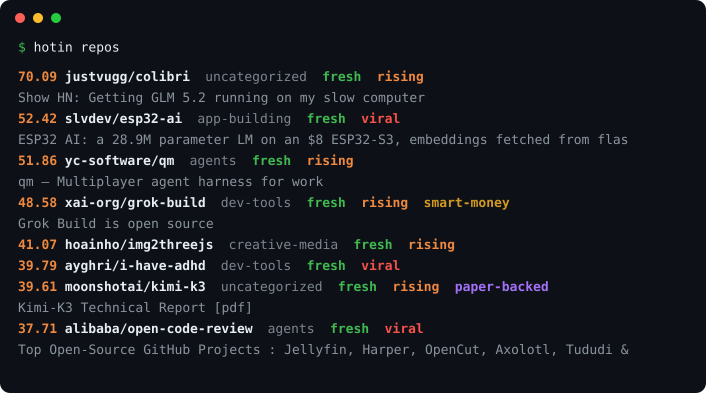

# hotin — the whole field, ranked. With receipts.

<p align="center">
  
</p>

<p align="center">
  <a href="https://pypi.org/project/hotin/"></a>
  <a href="https://pypi.org/project/hotin/"></a>
  
  <a href="https://hotin.ai">hotin.ai</a>
</p>

One command, one ranked list of what actually matters in AI today: repos,
models, papers and news. **Numbers are receipts, badges are verdicts.**

Every row shows why it is there: how fast it is growing, who backed it, where
else it surfaced. Nothing ranks on a single source's say-so.

**It works two ways, from one install.**

|  | you ask | your agent asks |
|---|---|---|
| | `hotin repos` in your terminal | `hotin mcp` inside Claude Code, Cursor, Codex or Gemini CLI |
| | you read the board | the agent reads the board mid-task, and cites it |

Your model's training data has a cutoff and a web search returns marketing. Ask
an agent what is worth using in AI this week and it guesses. Point it at hotin
and it answers with the same ranked evidence you would have read yourself.

## What it does

The zero-key core combines GitHub Trending, curated growth momentum, Hacker News, and npm velocity with no configuration. Add an optional key to unlock Reddit and YouTube (ScrapeCreators, or the official YouTube Data API v3), including curated repo-roundup channels. A “smart money” signal (repos the AI Insiders are backing) is included on a best-effort basis, and an AI-newsletter feed adds an editorial signal. Sources can be temporarily unavailable without taking down the CLI.

Beyond repos, hotin surfaces trending **AI models** (`hotin models`) and **papers** (`hotin papers`) as their own views, and a short daily **`hotin brief`** of what's happening across all of them. Run `hotin refresh` on a schedule and hotin records a time series, so the board can flag what's genuinely **rising** and **viral** (velocity, not just a snapshot) — not just what's big right now.

## Install

```sh
pip install hotin
```

hotin has zero dependencies, so a plain `pip install` is safe (nothing to conflict with). Prefer an isolated install, or don't want to install at all?

```sh
uvx hotin              # run without installing (needs uv)
uv tool install hotin  # persistent command via uv
pipx install hotin     # persistent command via pipx
```

No package manager, just Python? Grab the single-file `hotin.pyz` from the [latest release](https://github.com/abe238/hotinai/releases/latest) and run it:

```sh
python hotin.pyz
```

Developing on a checkout: `pip install -e .`.

## Use it from your AI agent (MCP)

The same board, callable by Claude Code, Cursor, Codex CLI, Gemini CLI, or
anything else that speaks MCP. No extra package: `pip install hotin` already
shipped it.

Add this to your MCP client config:

```json
{
  "mcpServers": {
    "hotin": { "command": "hotin", "args": ["mcp"] }
  }
}
```

Then ask your agent things it otherwise cannot answer:

> *"What AI repos are actually worth looking at this week?"*
> *"Is anything notable happening with open-weight models right now?"*
> *"Before we pick a library for this, what is trending and who is backing it?"*

Two tools are exposed. `hotin_board` returns any tab (`repos`, `rising`,
`insiders`, `models`, `papers`, `news`) with the receipts attached, and
`hotin_brief` returns the daily digest. Answers come back in about a second,
served from the local cache.

Set `GITHUB_TOKEN` if you want the `insiders` signal; everything else works
without any key.

## Quick start

```sh
hotin
```

Available commands:

| Command | Description |
| --- | --- |
| `hotin` | the flagship board (defaults to `repos`) |
| `hotin repos` | trending AI repos, fused across sources |
| `hotin insiders` | repos the AI Insiders are backing (the smart-money signal) |
| `hotin models` | AI models — lab press releases + trending weights |
| `hotin papers` | trending AI papers |
| `hotin news` | recent AI news headlines |
| `hotin brief` | a one-shot digest across every entity |
| `hotin refresh` | refresh all sources + record a snapshot (`--quiet` = headless) |
| `hotin export` | write the board to `docs/index.html` + `latest.json` |
| `hotin setup` | check config, or schedule automatic refreshes |
| `hotin search <query>` | search cached repos |
| `hotin show <owner/repo>` | show one repo |
| `hotin about` | show project information |

**Flags:** `--format text\|json\|md\|html` · `--limit N` (default 20) · `--source <name>` (repos: one upstream feed instead of the fused board) · `--since 30d` / `--min-stars N` (repos filters) · `--verbose`.

Each repo result presents a score, the owner/repo (clickable), category, and applicable badges: `fresh` (recently created or active), `rising` / `viral` (climbing fast on the recorded time series, `viral` being the rare accelerating-and-consensus extreme), `smart-money` (the AI Insiders are backing it), and `paper-backed` (linked from a trending paper). Consensus across sources is folded into the score itself, not shown as a badge.

Example (real output, top of a live run):

```text
$ hotin --limit 8
 30.59  xai-org/grok-build  agents  fresh
        Grok Build is open source
 22.17  justvugg/colibri  uncategorized
        Show HN: Getting GLM 5.2 running on my slow computer
 17.05  dietrichgebert/ponytail  app-building  fresh
 17.00  odysseus-dev/odysseus  uncategorized  fresh
 16.93  nexu-io/open-design  agents  fresh
 15.46  yuan1z0825/nature-skills  uncategorized  fresh
 15.24  bigpizzav3/codexplusplus  uncategorized  fresh
 14.77  antirez/ds4  inference  fresh
```

The first line of each result is score, owner/repo (clickable in a real terminal), category, and badges; a dimmed second line shows the human title when it adds context the slug doesn't. `fresh` reflects recent repository activity. In a live terminal the score and badges are colored. Your output will differ — it reflects what is actually hot when you run it.

## Why corroboration, not popularity

<details>
<summary>The board requires two independent signals. Here is the measurement behind that.</summary>

<br>

Ranking on "a well-known developer starred it" is the obvious design. It does not
hold up. Measured across 288 tracked repos, growth as a percentage of a repo's own
star count so size is not mistaken for heat:

| backed by | repos | growth |
|---|---:|---:|
| no notable star at all | 205 | 0.25 %/day |
| exactly one | 62 | **0.19 %/day** |
| two or more, independent | 21 | 0.55 %/day |

One star tracks slightly *worse* than no endorsement. Two or more tracks about
2x the baseline — though at n=21 that is p=0.087, suggestive rather than proven,
and the board rests on the first result rather than the second.

So nothing reaches the board on one source's say-so. It needs corroboration from
an independent signal, and it has to still be true a few hours later.

`scripts/measure_insider_signal.py` in the site repo re-runs this whenever you
want to check the claim.

</details>

## Keeping it fresh

hotin's `rising` / `viral` badges and the `hotin brief` come from a recorded time series, so they get better the more often `hotin refresh` runs. `hotin setup` can install a scheduled job for you:

```sh
hotin setup                     # interactive: once a day (8am) or twice (8am & 8pm)
hotin setup --schedule twice    # non-interactive: 8am & 8pm
hotin setup --schedule daily    # 8am only
hotin setup --schedule off      # remove it
```

On macOS/Linux this manages a marked block in your `crontab`; on Windows it creates `hotin-refresh` scheduled tasks. Either way it runs `python -m hotin refresh --quiet`, leaving the rest of your schedule untouched.

## Data Sources & Terms

hotin's code is licensed under Apache-2.0. That license does not relicense the underlying data returned by GitHub, Hacker News, npm, Reddit, or YouTube: each source's own terms of use apply.

The Reddit and YouTube integrations are unofficial third-party integrations via ScrapeCreators; they are not officially sanctioned by Reddit or YouTube. The smart-money signal is a best-effort read of a public AI-influencer graph and may change or break without notice.

## Contributing

Issues and contributions are welcome at the [issue tracker](https://github.com/abe238/hotinai/issues).

## License

Apache License 2.0 — see [LICENSE](LICENSE) and [NOTICE](NOTICE).

hotin was created by [Abe Diaz](https://github.com/abe238). If hotin, its ranking approach, or its ideas helped your project, a credit and link back to [github.com/abe238/hotinai](https://github.com/abe238/hotinai) are appreciated.

*Made by [@abe238](https://github.com/abe238) · [hotin.ai](https://hotin.ai)*
